

Many followed the call for posters and the results are AMAZING. We thank all participants for the great work! Some more information can be found on our [call for posters](/calls/posters) page.

*Please click on thumbnail to download PDF*

<h2 id="3">Perspectives of Women* participation in OpenStreetMap</h2>
<h3>Benedicta B. Ohene-Amadi</h3>

[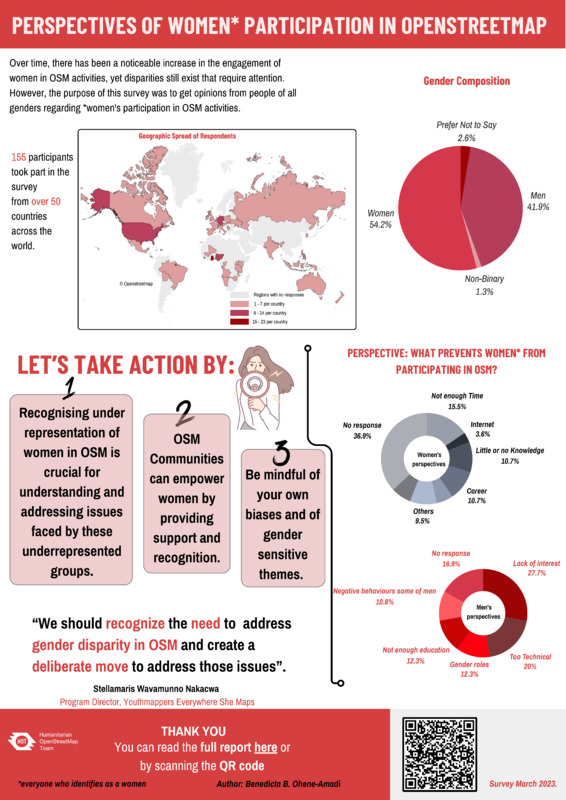](https://files.osmfoundation.org/s/xnoBYg6ayzKS8n8)

The poster I presented is about a survey I conducted in March, 2023 while I was interning with the Humanitarian OpenStreetMap Team (HOT). The survey was about the perspectives of women* participation in OpenStreetMap activities. The survey aimed to gather perceptions, opinions, and insights into why some women do not participate in OSM activities and what factors may discourage those who were already participating from continuing. The poster is a summarization of the report.

<h2 id="4">Mapping the World Together: Two Decades of Open Data</h2>
<h3>Olanrewaju Michael</h3>

[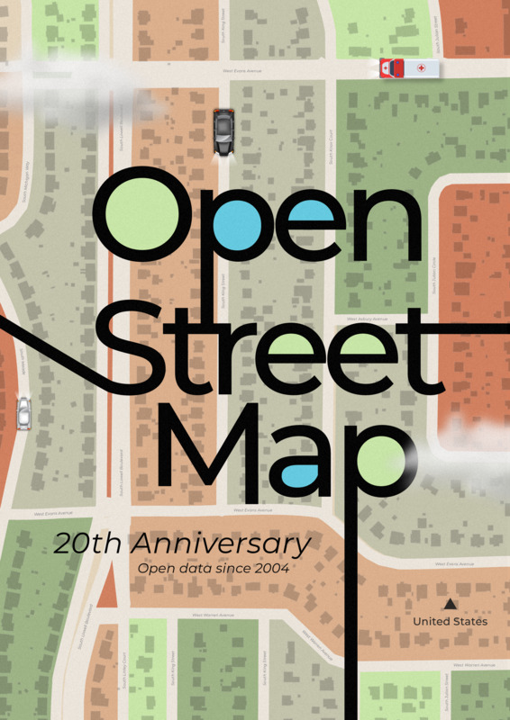](https://files.osmfoundation.org/s/3cqRyFPRLPPZtFk)

Imagine a world where everyone contributes together to build a global map. For 20 years, OpenStreetMap has turned this vision into reality, powered by tens of thousands of volunteers worldwide. This open geospatial data initiative has been key in solving humanitarian challenges, from disaster response to development planning. By mapping both remote and urban areas, OpenStreetMap empowers communities, enhances navigation, and supports critical missions. It’s a testament to how collective effort and open data can address real-world problems and foster global resilience. Together, let’s build a more accurate, comprehensive, and accessible map—one contribution at a time!

<h2 id="5">The power of community</h2>
<h3>Kontur.io</h3>

[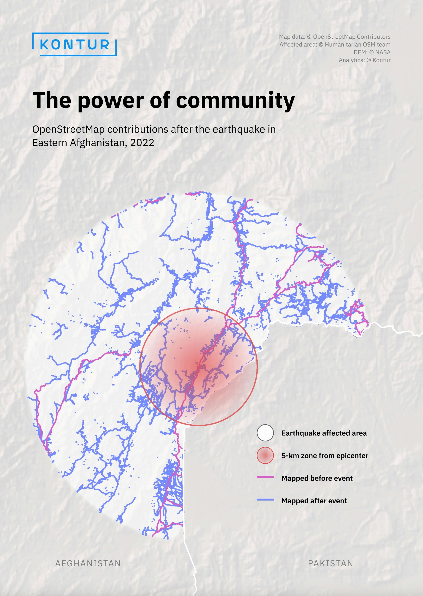](https://files.osmfoundation.org/s/eagRfxmsiA5TzG8)

OpenStreetMap data is not ideal. There are still gaps on the map of the world. However, the real power of the OSM community is how it reacts to humanitarian crises and natural disasters - quickly, publicly, and qualitatively.

<h2 id="6">Life Expectancy Evolution Map</h2>
<h3>Kontur.io</h3>

Inspired by national clothing and colors, here is our map to observe the upward trajectory of life quality in some African countries from 1960 to 2021

<h2 id="7">Bird's Eye Mapping: Uncovering Jiwaka Province's Remote Airstrips with MapSwipe and OpenStreetMap</h2>
<h3>Nashath Naufal & Jorieke Vyncke, Médecins Sans Frontières</h3>

[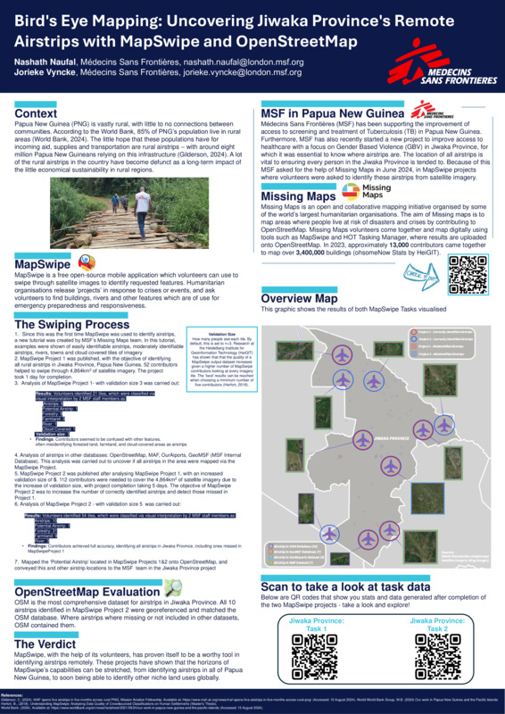](https://files.osmfoundation.org/s/tRg8JSrZFLAAEy4)

The poster shows the context, process and results of Medecins Sans Frontieres' (MSF) efforts of finding airstrips in Papua New Guinea (PNG). As around 85% of PNG's population live in rural areas, airstrips are a vital infrastructure for incoming aid, supplies and transportation. Locating all those airstrips in Jiwaka province was of importance to MSF operations as they can be used as aid routes. We asked the public to detect those airstrips via Mapswipe app and ran two sessions (with the second one taking in account deficiencies of the first one) resulting in positive outcome and accurate enough data to support field operations.

<h2 id="8">Venice Through the Ages: A Historical Map</h2>
<h3>Olanrewaju Michael</h3>

[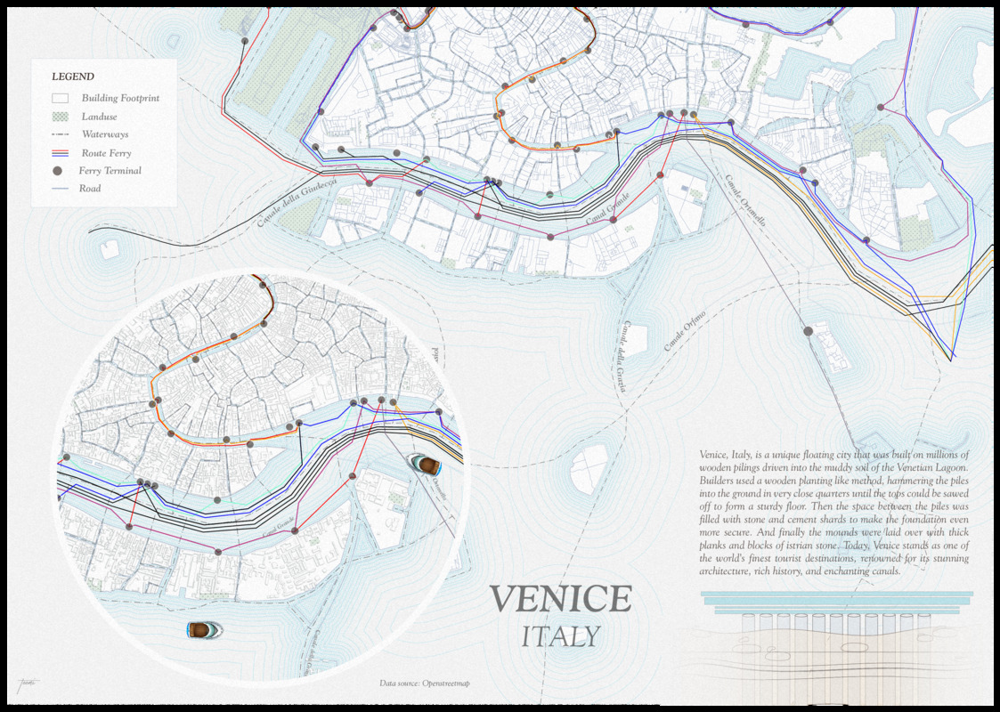](https://files.osmfoundation.org/s/GaS5FWNYZoyKarX)

"Venice Through the Ages: A Historical Map" offers a journey through the city's rich past, highlighting key moments in its development and architectural evolution. Venice, Italy, is a unique floating city that was built on millions of wooden pilings driven into the muddy soil of the Venetian Lagoon. Builders used a wooden planting-like method, hammering the piles into the ground in very close quarters until the tops could be sawed off to form a sturdy floor. Then the space between the piles was filled with stone and cement shards to make the foundation even more secure. And finally, the mounds were laid over with thick planks and blocks of istrian stone. Today, Venice stands as one of the world's finest tourist destinations, renowned for its stunning architecture, rich history, and enchanting canals.

<h2 id="9">Utilizing OpenStreetMap and Google Earth Engine for Urban Planning Case Study: Nyeri Town</h2>
<h3>Thitai Francis Ndiritu</h3>

The rapid pace of urbanization in many regions necessitates advanced tools for effective urban planning. Our project aims to leverage the rich datasets available through OSM, combined with the powerful analytical capabilities of GEE, to assess urban sprawl, infrastructure development, and accessibility within cities. By clipping data to a specific Area of Interest (AOI), buffering building footprints to estimate urban areas, and calculating road density, we are able to provide a comprehensive analysis that can support sustainable urban development.
One of the key features of the project is the ability to compare historical data from OSM or satellite imagery in GEE, allowing us to assess how urban areas have expanded over time. This historical perspective is crucial for understanding patterns of growth and planning for future infrastructure needs.

<h2 id="10">MAPA-ZCM: Collaborative map of the marine and coastal zones with OpenStreetMap and OpenSeaMap</h2>
<h3>Raquel Dezidério Souto</h3>

[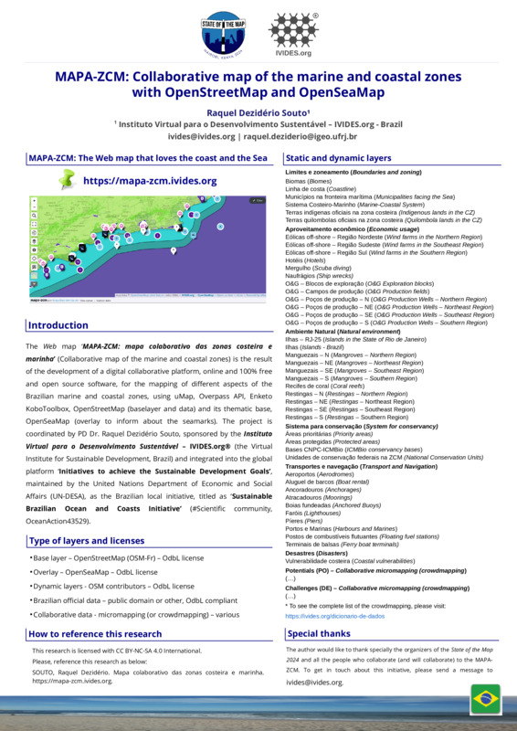](https://files.osmfoundation.org/s/W7btWWTZEiZMPDC)

The Web map ‘MAPA-ZCM: mapa colaborativo das zonas costeira e marinha’ (Collaborative map of the marine and coastal zones), available online in this direction: https://mapa-zcm.ivides.org, is the result of the development of a digital collaborative platform, online and 100% free and open source software, for the mapping of different aspects of the Brazilian marine and coastal zones, using uMap, Overpass API, Enketo KoboToolbox, OpenStreetMap (base layer and data) and its thematic base, OpenSeaMap (overlay to inform about the seamarks). The project is coordinated by PD Dr. Raquel Dezidério Souto (Brazil), sponsored by the Instituto Virtual para o Desenvolvimento Sustentável – IVIDES.org® (the Virtual Institute for Sustainable Development, Rio de Janeiro, Brazil) and integrated into the global platform ‘Initiatives to achieve the Sustainable Development Goals’, maintained by the United Nations Department of Economic and Social Affairs (UN-DESA), as a Brazilian local initiative, titled as ‘Sustainable Brazilian Ocean and Coasts Initiative’ (#Scientific community, OceanAction43529). As Brazil has initiated its process of Marine and Coastal Spatial Planning (MCSP) and has also a long tradition with a process of  Integrated Coastal Zone Management (ICZM), that is more than 30 years old, we hope that this platform can contribute with the local spatial knowledgement generation, provided by the proposed micromapping (or crowdmapping) and by the public access to our collaborative initiative.

<h2 id="11">HUB YouthMappers Rio de Janeiro: teaching OpenStreetMap through university extension projects in Brazil</h2>
<h3>Raquel Dezidério Souto</h3>

[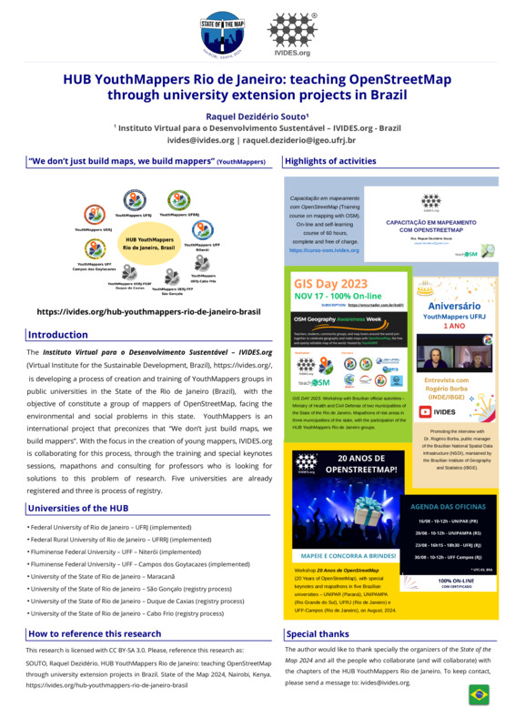](https://files.osmfoundation.org/s/sDA3eoY2f4k3k74)

The Instituto Virtual para o Desenvolvimento Sustentável – IVIDES.org (Virtual Institute for the Sustainable Development, Brazil), is developing a process of creation and training of YouthMappers groups in public universities in the State of the Rio de Janeiro (Brazil),  with the objective of constitute a group of mappers of OpenStreetMap, facing the environmental and social problems in this state.  YouthMappers is an international project that preconizes that “We don’t just build maps, we build mappers”. With the focus in the creation of young mappers, IVIDES.org is collaborating for this process, through the training and special keynotes sessions, mapathons and consulting for professors who is looking for solutions to this problem of research. Five universities are already registered and three is process of registry.

<h2 id="12">Mapping SotM 24 venue with fAIr</h2>
<h3>Anna Zanchetta</h3>

[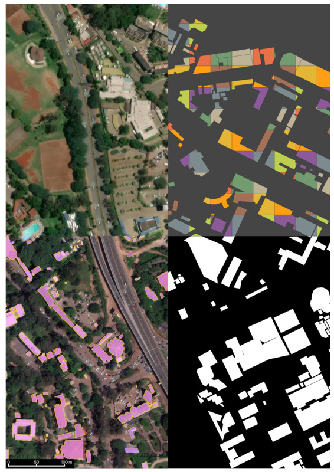](https://files.osmfoundation.org/s/wympd23NcPqS5ti)

What you see here is a composite image centered around the location where State Of the Map 2024 takes place, i.e. the University of Nairobi, Kenya.
The poster aims at showcasing the capabilities of fAIr - https://www.hotosm.org/tech-suite/fair/.
fAIr is a fully open AI-assisted mapping service to generate semi-automated building features developed by HOT, the Humanitarian OpenStreetMap team. In its current state, fAIr allows OSM mappers to create their own local training dataset, train/fine-tune a pre-trained AI model, and then map into OSM with the assistance of their own local model.
The imagery at high resolution (cm) to start mapping is openly available through OpenAerial Map - an open service that provides search and access to openly licensed satellite and unmanned aerial vehicle imagery uploaded by users to its website.
The image is made up of 4 quarters, each quarter contains 24 (at zoom 21) or 96 (at zoom 19) tiles which were obtained through fair-dev website - https://fair-dev.hotosm.org/.
The top-left quadrant image is an RGB imagery obtained via MapBox, used as ground-truth data. The top-right is buildings footprints obtained from OSM, which are converted to binary masks (bottom-right quadrant) used to train the model together with the RGB imagery. The bottom-left shows the output of the model inference (prediction of buildings) obtained after training, lovely!

<h2 id="13">saloni.ca</h2>
<h3>Panos Alevropoulos</h3>

[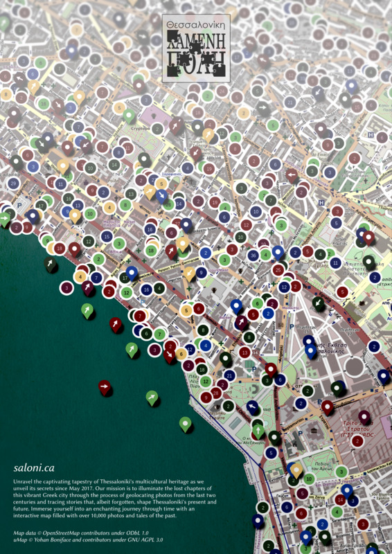](https://files.osmfoundation.org/s/oG5JA8dbaH9BeGg)

Project saloni.ca is a collaborative effort in Greece to revive the history of Thessaloniki through an interactive map. Like a virtual time machine, users can explore the city's past from the same angles and viewpoints where historic photographs were taken. In conjunction with OpenStreetMap data, one can delve into the history of buildings, trace their evolution, and discover the interconnected stories that have shaped Thessaloniki over time. For more detailed information, explanatory articles that accompany the photographs are available on archive.saloni.ca

<h2 id="14">Electric Vehicle (EV) Zone Planning Data Collection</h2>
<h3>Perkumpulan OpenStreetMap Indonesia</h3>

[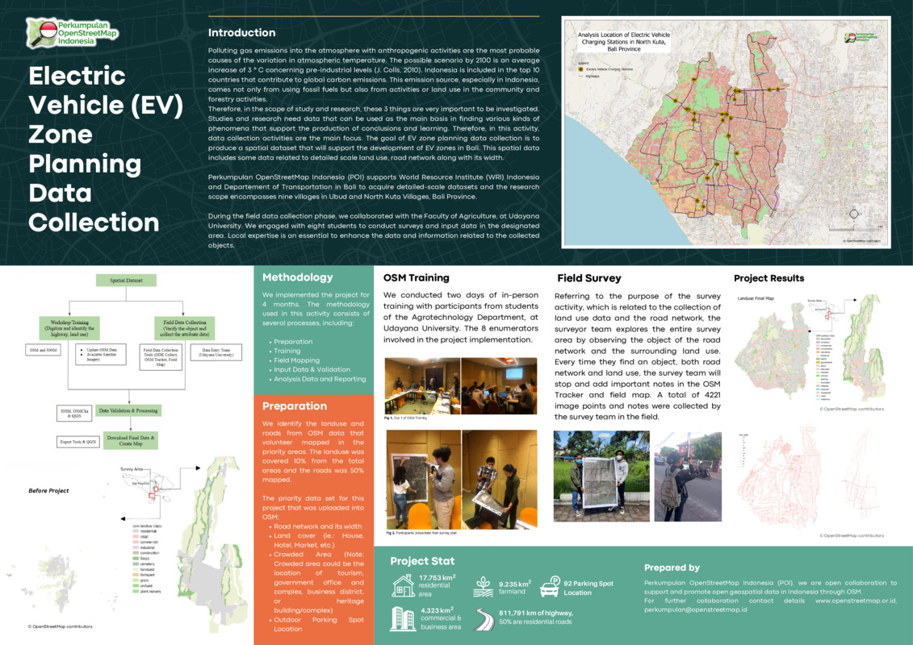](https://files.osmfoundation.org/s/942Xjdw8PZR9D5M)

The goal of EV zone planning data collection is to produce a spatial dataset that will support the development of EV zones in Bali. This spatial data includes some data related to detailed scale land use and road network along with its width.
Perkumpulan OpenStreetMap Indonesia (POI) supports the World Resource Institute (WRI) Indonesia and the Department of Transportation in Bali to acquire detailed-scale datasets and the research scope encompasses nine villages in Ubud and North Kuta Villages, Bali Province.
During the field data collection phase, we collaborated with the Faculty of Agriculture, at Udayana University. We engaged with eight students to conduct surveys and input data in the designated area. Local expertise is essential to enhance the data and information related to the collected objects.

<h2 id="15">Mapping for Impact: Addressing Data Quality through Community Collaboration</h2>
<h3>Perkumpulan OpenStreetMap Indonesia</h3>

[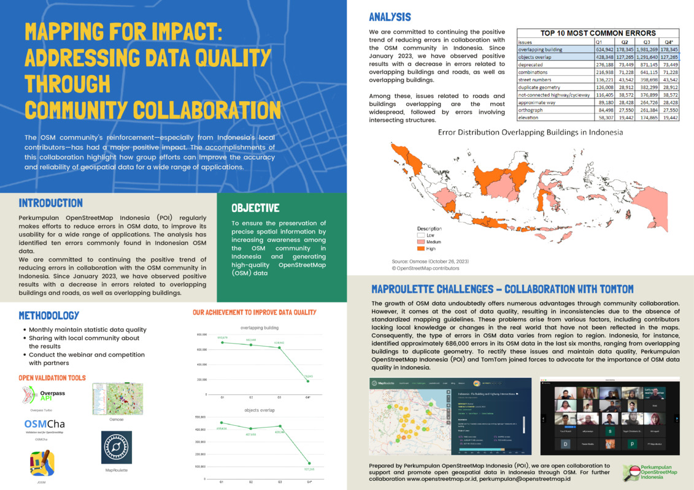](https://files.osmfoundation.org/s/Ng2fskfrdCMaD85)

The OSM community’s reinforcement—especially from Indonesia’s local contributors—has had a major positive impact. The accomplishments of this collaboration highlight how group efforts can improve the accuracy and reliability of geospatial data for a wide range of applications.
Perkumpulan OpenStreetMap Indonesia (POI) regularly makes efforts to reduce errors in OSM data, to improve its usability for a wide range of applications. The analysis has identified ten errors commonly found in Indonesian OSM data.
We are committed to continuing the positive trend of reducing errors in collaboration with the OSM community in Indonesia. Since January 2023, we have observed positive results with a decrease in errors related to overlapping buildings and roads, as well as overlapping buildings.

<h2 id="16">Building a "Livability Index" for India’s Informal Settlements</h2>
<h3>Jacob Kohn, Rushil Palavajjhala</h3>

[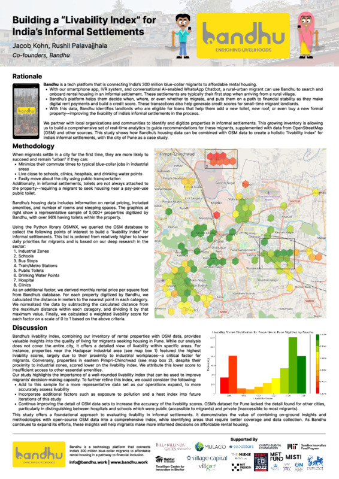](https://files.osmfoundation.org/s/fJ4FMZ6xC8zJeSq)

Bandhu is a tech platform that connects India’s 300 million blue-collar migrants to affordable rental housing. In this study, we calculate a “livability index” for informal settlements in Pune, India, using OSM’s data on amenities and transportation, and Bandhu’s rental housing database. This methodology puts forth a use case for combining on-ground insights with OSM data sets on urban infrastructure, in order to help migrants make more informed decisions on rental housing.

<h2 id="17">Crowd-Mapping's Impact on Humanitarian Response in Post-Emergency Scenarios</h2>
<h3>Halima Oulami et al.</h3>

[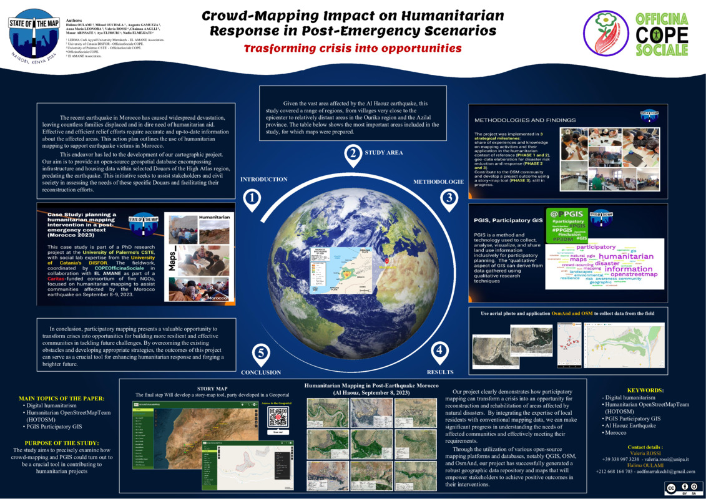](https://files.osmfoundation.org/s/2abbXL6beDf8D9e)

The document presents a study on collaborative mapping and its impact on humanitarian aid in response to the recent earthquake in Morocco, specifically in the Al Haouz region. The objective is to create an open-source geospatial database containing pre-earthquake infrastructure and housing data, aimed at supporting organizations and civil society in the assessment of needs and reconstruction processes. The adopted methodology involves the use of aerial photographs and the applications OsmAnd and OSM for data collection in the field. The results of the project demonstrate how participatory mapping can transform a crisis into an opportunity to build more resilient and effective communities in managing future challenges.
The humanitarian mapping activity is part of a bigger project financed by Caritas and involving five italian NGOS, and it involves various authors coming from different institutions including Cadi Ayyad University in Marrakech, the University of Catania, the University of Palermo,  the NGO COPE  with OfiicinaSocialeCOPE and the El AMANE Association. It has as its final objective the development of a story-map tool in a Geoportal. The study focuses on the use of open-source platforms and databases such as QGIS, OSM, and OsmAnd to generate a repository of geographic data and maps that will empower stakeholders in their interventions.
Keywords include digital humanitarianism, Humanitarian OpenStreetMapTeam (HOTOSM), PGIS (Participatory GIS), Al Haouz earthquake, and Morocco.

<h2 id="18">OpenHerMap: Mapping Women’s Space</h2>
<h3>OpenHerMap</h3>

[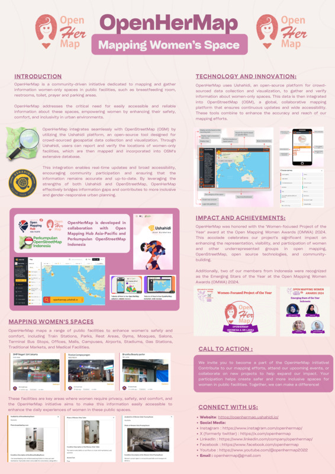](https://files.osmfoundation.org/s/yrLfPk8D8fgDGad)

OpenHerMap is a platform dedicated to mapping women-only spaces in public facilities across various cities. Our initiative focuses on enhancing the accessibility and safety of these spaces for women and ensuring that their needs are well-represented in public infrastructure. The poster highlights key aspects of our project, including the scope of our mapping efforts, the types of facilities we cover, and the impact we aim to achieve. We have mapped women-only spaces in several cities across Indonesia (Jakarta, Bandung, Yogyakarta, Solo, Pontianak) and Sri Lanka (Moratuwa). The facilities we focus on include train stations, parks, rest areas, gyms, mosques, salons, bus terminals, offices, malls, campuses, airports, stadiums, gas stations, traditional markets, and medical facilities. Our survey collects detailed information about the availability and condition of women-only spaces, such as toilets, breastfeeding rooms, praying rooms, parking areas, and women-only hours. The poster also illustrates our commitment to community engagement and collaboration with local stakeholders to ensure our data is accurate and useful for urban planning and policy-making.

<h2 id="20">Map Kerala Initiative</h2>
<h3>Manoj Karingamadathil, Athul R T</h3>

<h2 id="21">Natural Disaster Management in Ethiopia: Leveraging OSM for Resilience</h2>
<h3></h3>

[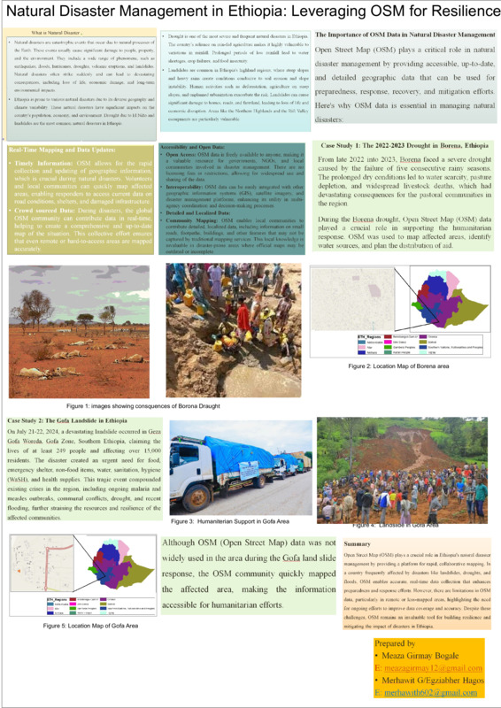](https://files.osmfoundation.org/s/ngRkALewSK89nj2)

<h2 id="22">Meta Poster</h2>
<h3>GuardedBear</h3>

[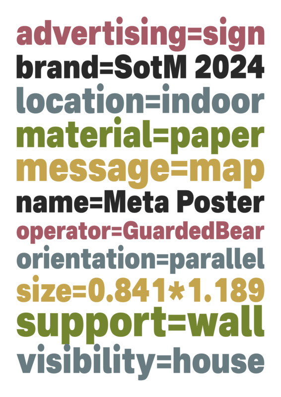](https://files.osmfoundation.org/s/ngRkALewSK89nj2)

This 'meta' poster shows how a poster/sign might be tagged in OpenStreetMap. The tags/values are as accurate as possible, despite the fact that this isn't a real example of something that would typically be added to OSM.
It was made using Inkscape, with the [Nacelle font](https://dotcolon.net/font/nacelle) and the [Tarot 7](https://lospec.com/palette-list/tarot7) colour scheme. Licensed under CC-BY-SA 3.0.
